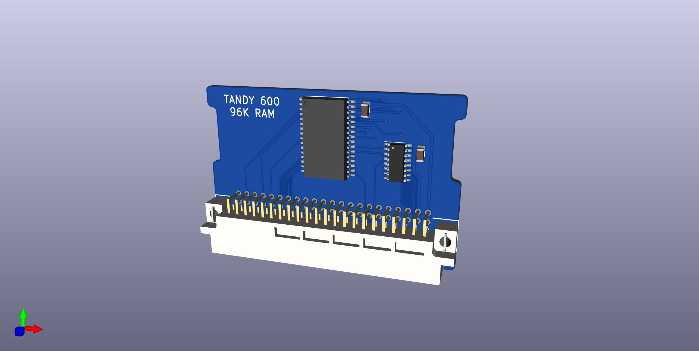
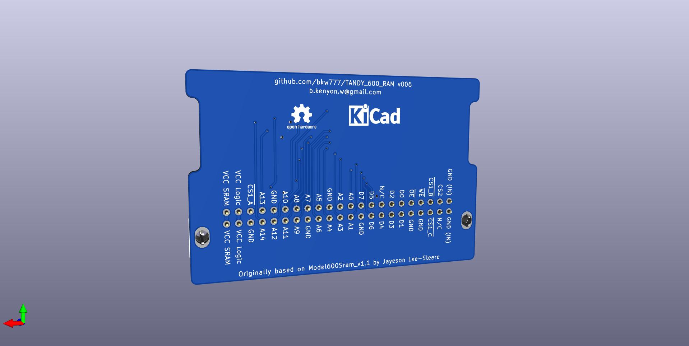
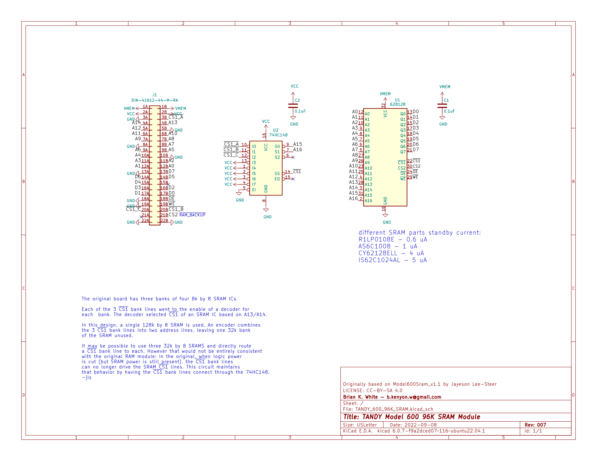
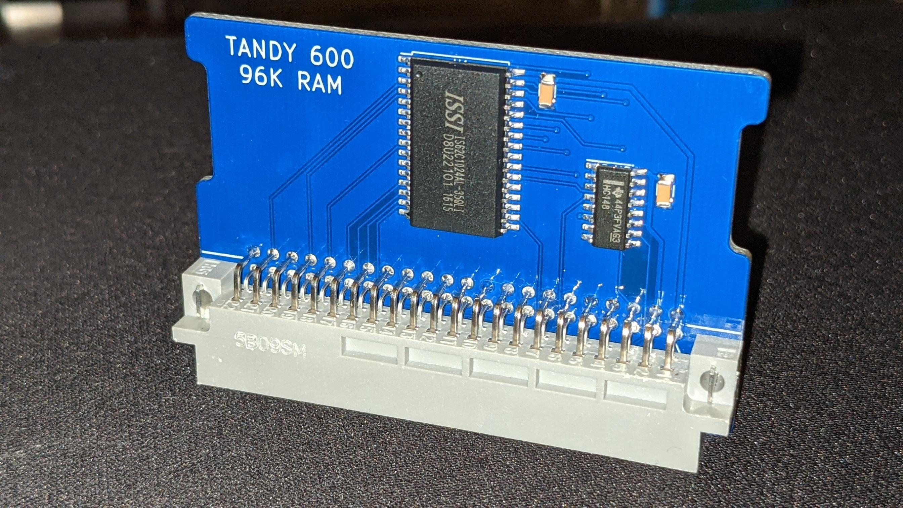
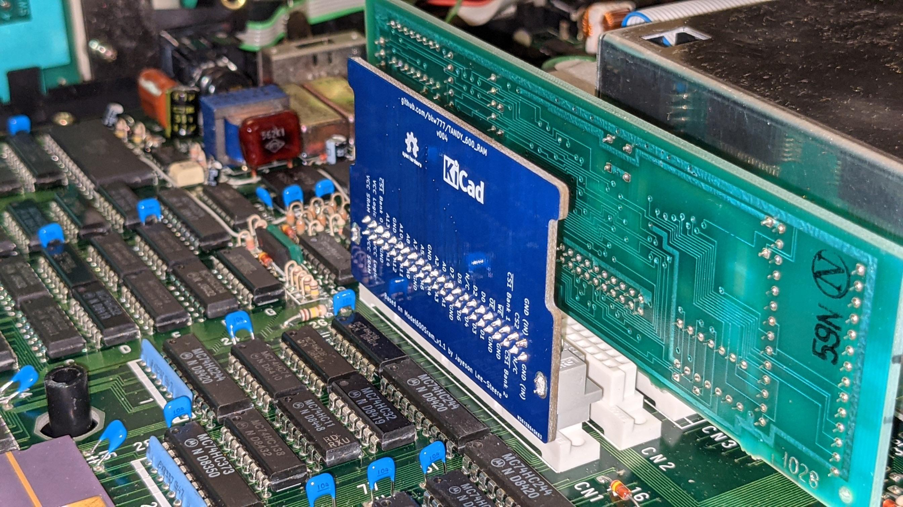

# 96K SRAM for TANDY 600

  
  
  

[PCB from OSHPark](https://oshpark.com/shared_projects/ECt9SjHd)  
[PCB from PCBWAY](https://www.pcbway.com/project/shareproject/TANDY_600_RAM.html)  

[BOM from DigiKey](https://www.digikey.com/short/40jz275w)

[Gerbers](../../releases/latest)

# History / Credits

* 20211111 [v005](../../releases/v005) - Widen 74HC148 footprint to allow either SOIC or SOP

* 20210812 [v004](../../releases/v004) - Un-scramble the address & data lines so for example D4 on the bus goes to D4 on the chip. Redraw the schematic. Redraw the pcb. Add scans of a few relevant pages from the TANDY 600 Service Manual.

* 20210812 [v003](../../releases/v003) - Removed the 74HC08

* 20210811 [v002](../../releases/v002) - Moved all symbols and footprints to project-local 000\_LOCAL.lib and 000\_LOCAL.pretty. Added 3d models. Massaged the PCB layout and silkscreen. The circuit is still the original circuit electrically.

* 20170104 [v001 / Model600Sram_v1.1](../../tree/JLS-1.1) - I asked on the Tandy Color Computer Facebook group if anyone could clone a 96K ram board for Model 600, and Jayeson Lee-Steere produced Model600Sram_v1.1 and placed it in the public domain.  
https://www.facebook.com/groups/2359462640/permalink/10154864662292641/
