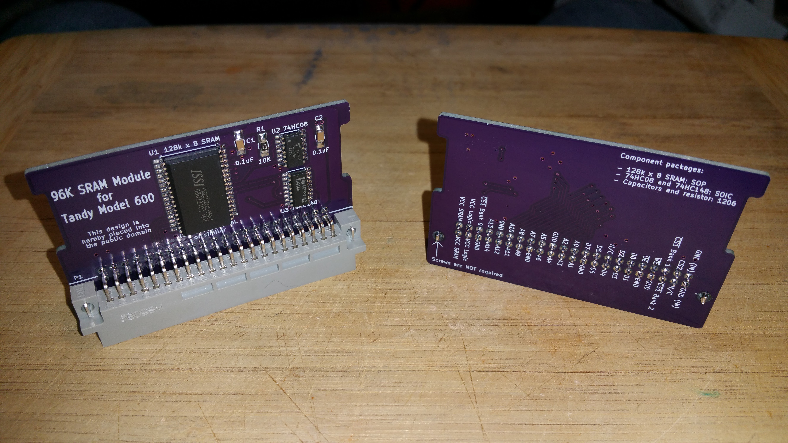

# 96K SRAM for TANDY 600

  
  
  

[DigiKey BOM](TANDY_600_RAM.BOM.csv)

PCB: 

BOM: http://www.digikey.com/short/3r12m5

http://tandy.wiki/JLS-96K

(pictures show Model600Sram_v1.0, not the current revision)

# History / Credits

* 20210811 Made Jayeson's original KiCad files more portable and self-contained. Added 3d models. Added 000_LOCAL schemtic and footprint libraries, copied all compnents and footprints and updated all references so the files are self-contained. Massaged the PCB layout and silkscreen. The circuit is still the original circuit electrically.  

Based on Model600Sram_v1.1 by Jayeson Lee-Steere (See git branch "JLS-1.1").  

2017 Jan 04 - I asked on the Tandy Color Computer Facebook group if anyone could clone the 96K ram board for Model 600, and Jayeson Lee-Steere did so. I sent him an original module to examine, and he produced Model600Sram_v1.1 and placed it in the public domain.  
https://www.facebook.com/groups/2359462640/permalink/10154864662292641/

