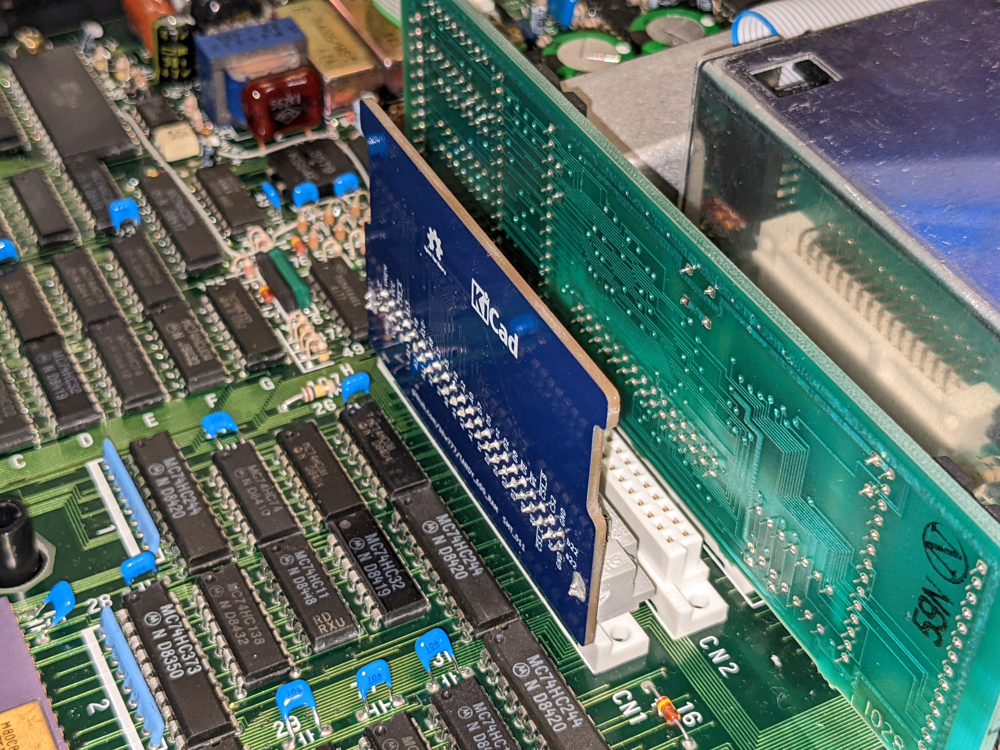

# 96K SRAM for TANDY 600

  
  
  
  

[PCB from OSHPark](https://oshpark.com/shared_projects/nBVWvJ2W)  
[PCB from PCBWAY](https://www.pcbway.com/project/shareproject/TANDY_600_RAM.html)  

[BOM from DigiKey](https://www.digikey.com/short/bmpbhbtb)

[Gerbers](../../releases/latest)

----

# TINY Version

  
  
  
  

[BOM for tiny version](https://www.digikey.com/short/dd84d9w2)

# History / Credits

In 2017 I asked on the Tandy Color Computer Facebook group if anyone could clone a 96K ram board for Model 600, and Jayeson Lee-Steere produced Model600Sram_v1.1 and placed it in the public domain.  
https://www.facebook.com/groups/2359462640/permalink/10154864662292641/

This version has been modified somewhat since then.
